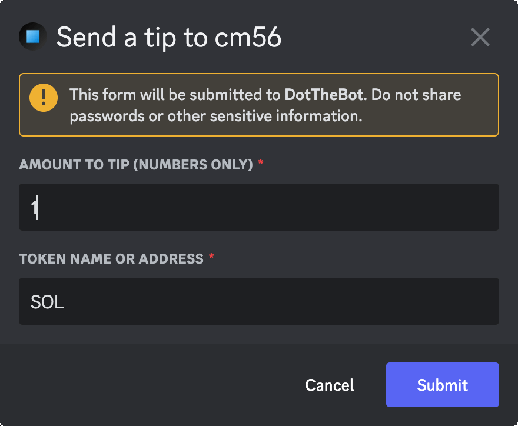

# Send a Tip to a Member

This command will allow you to send a tip to a member without having to know their wallet address. You will be presented with both a QR code that can be scanned with your mobile wallet and a link that can be used on either mobile or desktop to send the tip with your wallet of choice.

:::info

Default Permissions: **Everyone**  
Command Type: **User Command**

:::

## Modal Fields

1. **Amount** - A number amount that you want to send
2. **Token** - The name or token address of what to send (eg. SOL, UDSC, etc)

## Usage Example

1. Right-click on a member.
2. Select **Apps**
3. Select **Send Tip**
4. You will be presented with a form dialog.
   - Fill in the **Amount To Tip**
   - Fill in the **Token Name or Address**
   - Submit the form

## Screenshots

