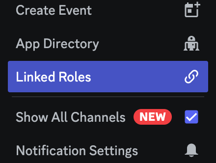
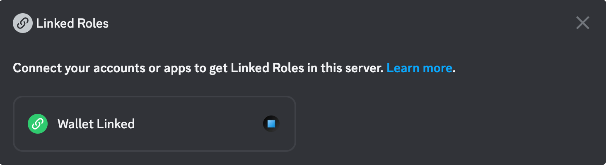
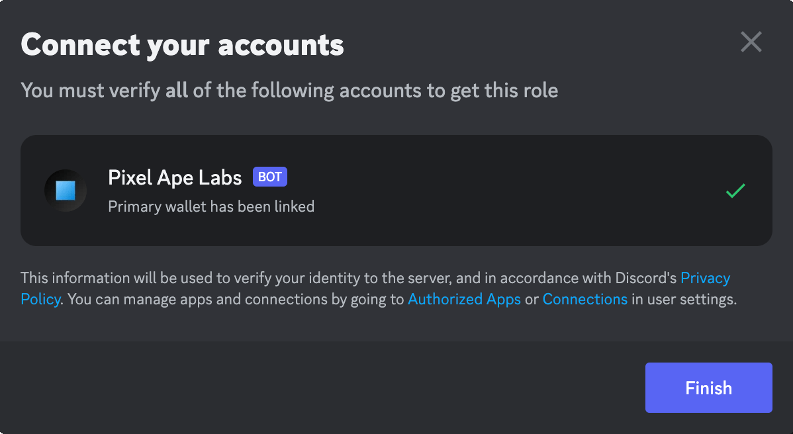

# Linked Roles

## Link roles to Pixel Ape Labs

## What are Linked Roles?

According to Discord,

> "Linked Roles: a new type of role that’s created by authenticating your profile with an account outside of Discord".
>
> [Discord Product Feature Announcement](https://discord.com/blog/connected-accounts-functionality-boost-linked-roles)

## What Linked Roles Are Available?

### Wallet Linked

This role can be automatically assigned to any user who has linked at least one (1) wallet on Pixel Ape Labs.

## How To Create A Linked Role

1. Go to your server settings and create a new role.
2. Navigate to the **Links** tab.
3. Click on the **Add Requirement** button.
4. Select **Pixel Ape Labs** from the Apps section.
5. Turn on the **Wallet Linked** requirement.
6. Save the role.

## How Are Linked Roles Assigned?

While it is up to those who manage the Discord server to create the linked roles, it is up to each individual member to claim the roles themselves.

1. In Discord, open the server menu at the top of the channel list. From there select Linked Roles.

2. Select the desired Linked Role from the menu. In this example, the role is called **Wallet Linked**.

3. Verify that you meet the criteria to claim the role. If not, you will be presented with a link to complete this step.

4. Click on the **Finish** button to receive the role.
