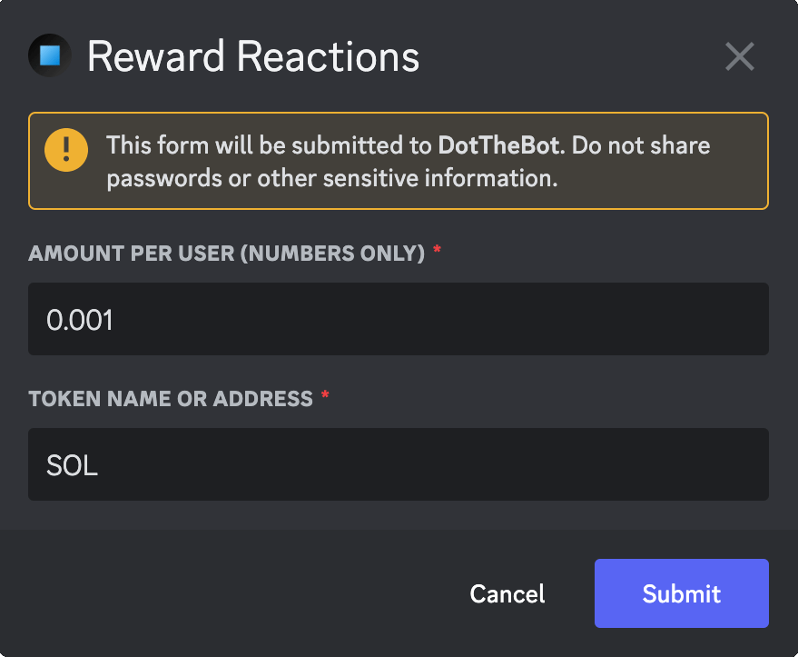
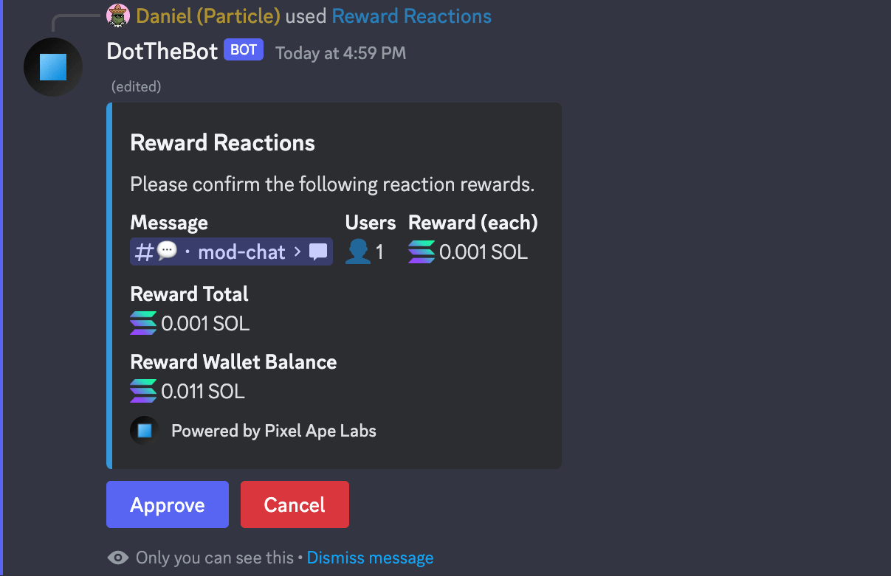
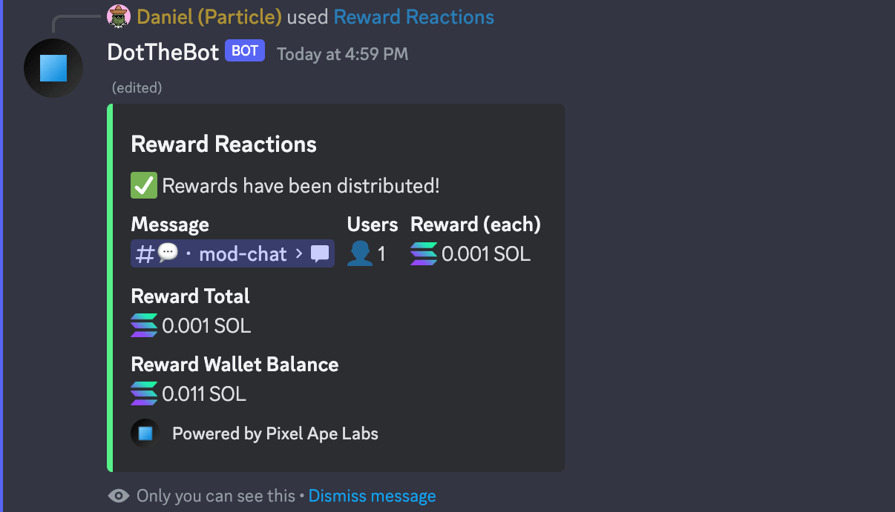

# Reward Reactions for the selected message

This command will return a modal for you to reward each person who has reacted to the message.

:::info

Default Permissions: **Administrators**  
Command Type: **Message Command**

:::

## Usage Example

1. Right-click on a message.
2. Select **Apps**
3. Select **Reward Reactions**

## Response

1. A modal is returned allowing you to specify an amount and token to reward each user. The default values can be set up in the server settings on the Pixel Ape Labs website.

2. A message is returned asking you to confirm and approve the reward amount, showing you the number of unique users, reward per user, reward total, and your reward wallet balance.

3. Once approved, the message is updated, showing you that the rewards have been distributed.

