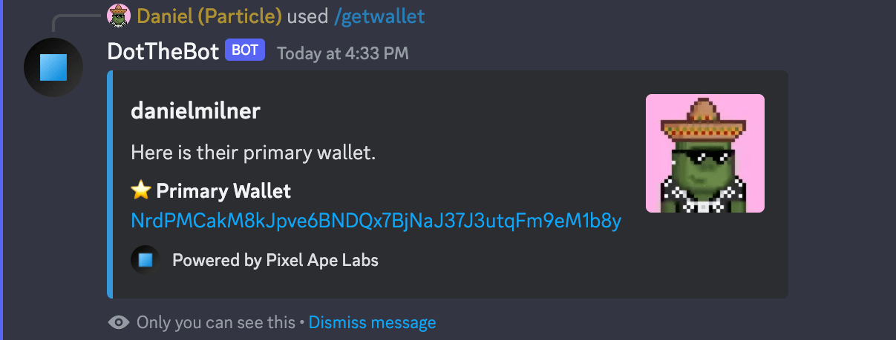

# Retrieve the Primary Wallet of a Member

This command will return the primary wallet of a member if they have linked a wallet to their profile on Pixel Ape Labs.

:::info

Default Permissions: **Guild Managers**  
Command Type: **Slash Command**

:::

## Parameters

1. Member

## Usage Example

### Slash Command

```
/getwallet @danielmilner
```

### Bot Response


