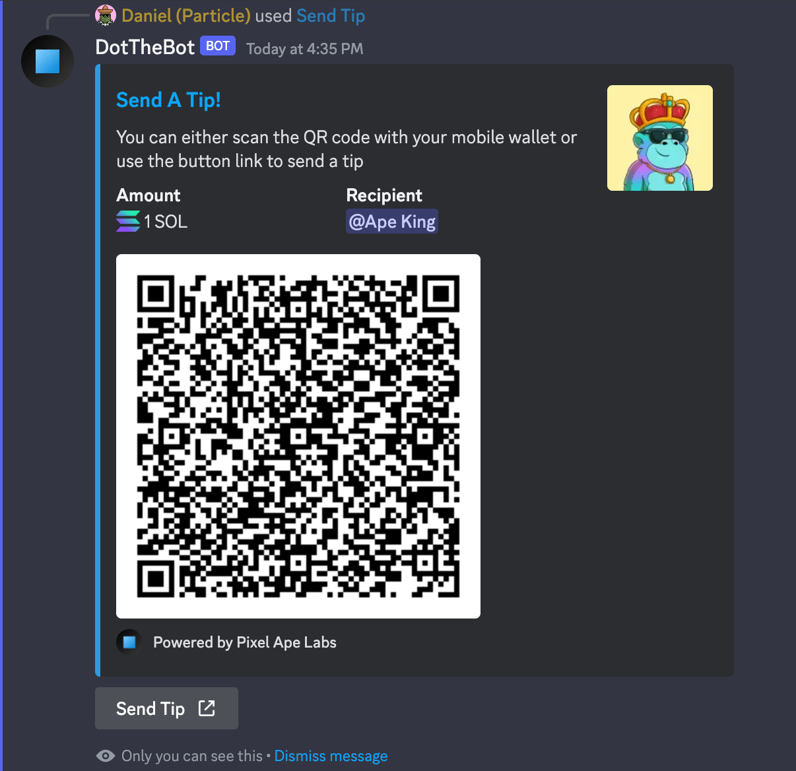

# Send a Tip to a Member

This command will allow you to send a tip to a member without having to know their wallet address. You will be presented with both a QR code that can be scanned with your mobile wallet and a link that can be used on either mobile or desktop to send the tip with your wallet of choice.

:::info

Default Permissions: **Everyone**  
Command Type: **Slash Command**

:::

## Parameters

1. **Member** - The member's @ mention
2. **Amount** - A number amount that you want to send
3. **Token** - The name or token address of what to send (eg. SOL, UDSC, etc)

## Usage Example

### Slash Command

```
/tip @Member 1 SOL
```

### Bot Response


